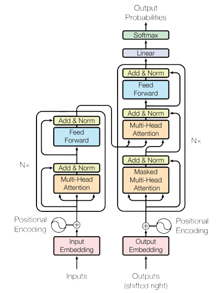

# Transformer Implementation from Scratch

<div style="display: flex; align-items: center;">
    
    <div>
        <p>
        This repository contains a full implementation of the Transformer model from scratch using PyTorch. The Transformer model, introduced in the paper <a href="https://arxiv.org/abs/1706.03762">"Attention is All You Need"</a> by Vaswani et al., revolutionized the field of natural language processing by replacing traditional recurrent models with a self-attention mechanism.
        </p>
    </div>
</div>

## Overview

The Transformer is a deep learning model architecture that relies solely on self-attention mechanisms. It enables highly parallelizable training compared to recurrent models, making it ideal for tasks such as machine translation, text generation, and more. This repository implements the following components of the Transformer from scratch:

- **Self-Attention Mechanism**
- **Positional Encoding**
- **Multi-Head Attention**
- **Feed Forward Networks**
- **Encoder-Decoder Architecture**

This repository does not rely on pre-built transformer libraries, making it ideal for learning purposes and understanding the underlying architecture of transformers.

## Installation

To get started, clone the repository and install the necessary dependencies:

```bash
git clone https://github.com/SumitSuryawanshi123/Transformer_Implementation_from-scratch.git
cd Transformer_Implementation_from-scratch
pip install -r requirements.txt
```